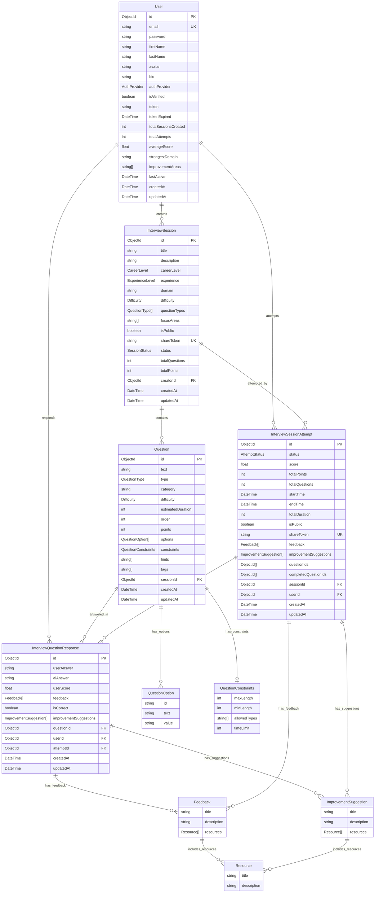

# Mock Interview Generator POC Document

## Project Overview

This Proof of Concept (POC) will demonstrate a mock interview generator using Gemini AI API and LangChain in a Next.js application. The system will generate customized interview questions based on user parameters, present them in an interactive form, and provide detailed feedback on responses.

## Core Features

### 1. Question Generation API

-   **Input**: Accepts parameters like experience level, field type, question types, etc.
-   **Processing**: Uses LangChain with Gemini AI to generate context-aware questions
-   **Output**: Returns structured JSON with questions, options, metadata

### 2. Dynamic Form Rendering

-   Auto-generates forms based on question types (radio, checkbox, text, etc.)
-   Includes timers based on estimated question time
-   Responsive UI that adapts to different question formats

### 3. Evaluation & Feedback System

-   Analyzes user responses using AI
-   Provides detailed feedback with strengths and improvement areas
-   Generates motivational insights

### 4. Export & Share Functionality

-   Email results to user or recruiter
-   Export to PDF, Excel, JSON formats
-   Shareable links for results

### 5. Public Session Sharing

-   Users can create public interview sessions
-   Shareable sessions via unique tokens
-   Other users can attempt public sessions
-   Session creators can track attempts and performance


## Prompt Template Example to Generate Questions

```ts
const universalInterviewPrompt = new PromptTemplate({
	template: `
  You are an expert interview designer creating questions for all career types. 
  Generate {totalQuestions} questions based on these parameters:

  ### Interview Parameters:
  - Title: {title}
  - Description: {description}
  - Career Level: {careerLevel}
  - Experience: {experience}
  - Domain: {domain}
  - Difficulty: {difficulty}
  - Question Types: {questionTypes}
  - Focus Areas: {focusAreas}

  ### Required JSON Format:
  {
    "metadata": {
      "title": "{title}",
      "description": "{description}",
      "careerLevel": "{careerLevel}",
      "experience": "{experience}",
      "domain": "{domain}",
      "difficulty": "{difficulty}",
      "questionTypes": {questionTypes},
      "focusAreas": {focusAreas},
      "totalQuestions": {totalQuestions},
      "totalPoints": "sum of all question points",
      "estimatedDuration": "sum of all durations"
    },
    "questions": [
      {
        "text": "string", // Plain text fallback
        "content": [
          {
            "type": "paragraph",
            "data": {
              "text": "string" 
            },
            "order": 1
          },
          {
            "type": "list",
            "data": {
              "items": ["string"],
              "style": "ordered|unordered"
            },
            "order": 2
          },
          {
            "type": "code",
            "data": {
              "code": "string",
              "language": "string"
            },
            "order": 3
          },
          {
            "type": "media",
            "data": {
              "url": "string",
              "caption": "string",
              "altText": "string"
            },
            "order": 4
          },
          {
            "type": "table",
            "data": {
              "headers": ["string"],
              "rows": [
                {
                  "cells": ["string"]
                }
              ]
            },
            "order": 5
          }
        ],
        "type": "MULTIPLE_CHOICE|CHECKBOX|TEXT|DROPDOWN|RATING|CODING",
        "category": "string",
        "difficulty": "EASY|MEDIUM|HARD",
        "estimatedDuration": number,
        "points": number,
        "order": number,
        "options": ["string"],
        "constraints": ["string"],
        "hints": ["string"],
        "tags": ["string"],
        "idealAnswer": "string"
      }
    ]
  }

  ### Content Block Rules:
  1. Each question must have at least one content block
  2. Order must be sequentially numbered starting from 1
  3. Maintain consistent block types:
     - paragraph: For regular text
     - list: For bullet points (use "ordered" for numbered)
     - code: For code snippets (specify language)
     - media: For images/diagrams (include alt text)
     - table: For tabular data

  ### Example Question:
  {
    "text": "Explain React hooks and list 3 commonly used ones",
    "content": [
      {
        "type": "paragraph",
        "data": {
          "text": "React hooks allow you to use state and other React features without writing classes."
        },
        "order": 1
      },
      {
        "type": "list",
        "data": {
          "items": [
            "useState - For state management",
            "useEffect - For side effects",
            "useContext - For global state"
          ],
          "style": "unordered"
        },
        "order": 2
      }
    ],
    "type": "TEXT",
    "category": "React",
    "difficulty": "MEDIUM",
    "estimatedDuration": 120,
    "points": 10,
    "order": 1,
    "constraints": { mix : 20, max : 100 },
    "hints": ["Think about lifecycle methods"],
    "tags": ["react", "hooks", "frontend"],
    "idealAnswer": "React hooks are functions that let you hook into React state... (full answer)"
  }

  Now generate questions matching these specifications.
  `,
	inputVariables: [
		"title",
		"description",
		"careerLevel",
		"experience",
		"domain",
		"difficulty",
		"questionTypes",
		"focusAreas",
		"isPublic",
		"totalQuestions",
	],
});
```

## Database Model Relation Mermaid


